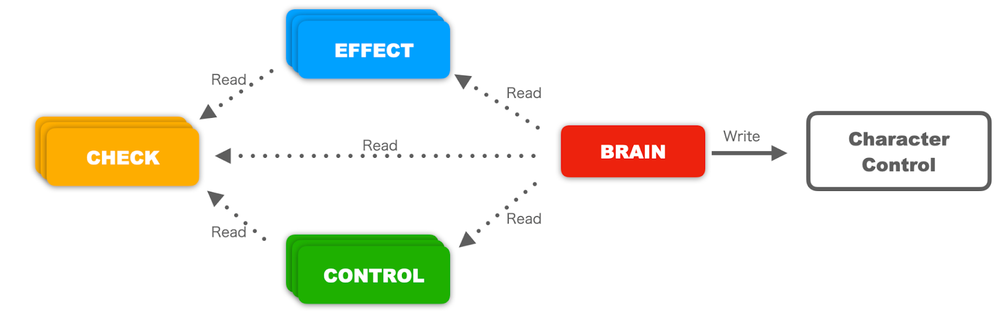

# Project_TCC v.1.0.2
TCC stands for **Tiny Character Controller**. TCC provides a comprehensive solution for creating your own game.

This repository contains all packages and examples for TCC projects.

Project_TCC is the latest Unity-Chan! project. Enjoy yourselves!

## 2024/02/09: Information and disclaimer
We appreciate your interest in Project_TCC.

This project and repository "Project_TCC" is provided as-is, without any maintenance or release plan.

Therefore, we are unable to monitor bug reports, accept feature requests, or review pull requests for this package.

However, we recognize that some users may wish to continue utilizing and enhancing Project_TCC. In that case, we recommend that you fork the repository. This will allow you to make changes and enhancements as you see fit.

## Release Information
* 2024/02/21 : Project_TCC v.1.0.2 : Bug Fixed version / Merged [PR#1](https://github.com/unity3d-jp/Project_TCC/pull/1)
* 2024/02/19 : Project_TCC v.1.0.1 : Bug Fixed version.
* 2024/02/09 : Project_TCC v.1.0.0 : First Release.

## License Notice
* Project_TCC is licensed by Unity Companion License v.1.3
https://unity.com/ja/legal/licenses/unity-companion-license.

* All character assets "Unity-Chan!" are licensed by Unity-Chan License 2.0(UCL 2.0)
https://unity-chan.com/contents/guideline/
https://unity-chan.com/contents/guideline_en/

* Some sound effects data that contains in this project is made by GameSynth.
The official GameSynth URL is below:
http://tsugi-studio.com/web/jp/products-gamesynth.html

* This project contains the font 'Source Han Sans' font. This font is licensed by Adobe and SIL OPEN FONT LICENSE v.1.1
https://github.com/adobe-fonts/source-han-sans?tab=License-1-ov-file#License-1-ov-file

---
# Project TCC 解説ドキュメント

## Project_TCCが開発されたUnityのバージョン
* Unity 2023.2.0f1

## 概要

* Tiny Character Controller (TCC) は、キャラクターの挙動を複数の小さなコンポーネントを組み合わせて実現するシステムです。

* TCCでは、キャラクターの移動、ジャンプ、カメラ制御などの基本動作をはじめとした多様な機能を提供し、柔軟なキャラクター表現を実現します。各コンポーネントが持つプライオリティ（優先順位）を設定することで、応用の効くキャラクター制御を可能にします。

* TCCは外部からの入力に対応し、Visual Scriptingからの制御もサポートしています。

* また、ゲーム開発を支援するための様々な補助機能も提供しており、UI表示、オブジェクトプール、シナリオインポーター、ゲームデータの保存、シーンの切り替えを簡単かつ安全に行い、シーンのレイヤー化や段階的なロードを容易にするシーンローダーなどのユーティリティが含まれます。

## TCCの基本概念

TCCには、キャラクターを制御するための4つの基本的なコンポーネントがあります。

1. **[Brain](./Documentations/Componentlist_ja.md#brain)**
   - キャラクターの最終的な座標を更新するコンポーネントです。
   - Check、Effect、Controlの結果を集約し、Transformに書き込みます。
   - 移動・ベクトル計算・センサー処理を集中管理します。

2. **[Check](./Documentations/Componentlist_ja.md#check)**
   - 周囲の情報を収集するセンサーコンポーネントです。
   - 地面の接地判定、頭上の接触判定、視界判定などを行います。
   - 更新時に値をキャッシュし、他コンポーネントへ処理結果を提供します。

3. **[Control](./Documentations/Componentlist_ja.md#control)**
   - プレイヤーの入力に応じてキャラクターの動きを制御するコンポーネントです。
   - 移動、ジャンプ、カメラ制御などのキャラクター操作を管理します。
   - 移動方向や移動速度、ジャンプの高さなどを調整します。

4. **[Effect](./Documentations/Componentlist_ja.md#effect)**
   - キャラクターに追加の動きや影響を与えるコンポーネントです。
   - 重力、プラットフォームとの相互作用、追加力(AddForce)などを扱います。
   - キャラクターの動きにバリエーションやリアリズムを加える働きをします。

これらのコンポーネントを組み合わせることで、複雑なキャラクター挙動を簡単に構築し、カスタマイズすることが可能となっています。

各コンポーネントは以下のようなネットワークで、キャラクター制御に必要な情報を収集し、座標や動作を更新する処理命令を通知しています。

またControl系のコンポーネントには、各コンポーネントごとにそのキャラクターの位置（Transform）や向き（Rotation）変化に与える影響の優先度を設定する、プライオリティがありますので、1体のキャラクターゲームオブジェクトに複数のControlをアタッチし、状況に応じて切り替えることが可能です。

## Project_TCC に含まれる、様々な機能コンポーネント群

Project_TCCに含まれる主要なコンポーネント群について、その概要と主なコンポーネント名および機能を以下にまとめます。いずれもがゲーム制作に便利なコンポーネントとなっています。

なお全てのRuntimeコンポーネントのリストは、**【プロジェクト内のドキュメンテーション（[日本語](./Documentations/Componentlist_ja.md) / [English](./Documentations/Componentlist_en.md)）】** にあります。

---
### 1. [Brain](./Documentations/Componentlist_ja.md#brain)
**概要:** 
- TCCのControlやEffectなどからの情報を集約し、キャラクターの座標を更新するコンポーネント群です。

**代表的なコンポーネント:**

- **CharacterBrain**: CharacterControllerを使用して座標を更新。アクションゲームに適しており、CharacterControllerの機能を利用します。
- **RigidbodyBrain**: Rigidbodyを使用して座標を更新し、物理演算に基づいた動作を行います。物理演算が必要なゲームに適しています。
- **NavmeshBrain**: NavmeshAgentを利用して座標を更新し、RPGなどNavmeshで移動範囲を制限するゲームに適しています。
- **TransformBrain**: Transformを使用してキャラクターの座標を更新。PhysicsやColliderの判定は行わず、主にストラテジーゲームやインタラクションの少ないゲームで使用。

---
### 2. [Check](./Documentations/Componentlist_ja.md#check)
**概要:** 
- キャラクターの周辺情報を収集するセンサーコンポーネント群です。

**代表的なコンポーネント:**
- **Ground Check**: 地面との接地判定を行います。地面までの距離や勾配、地面オブジェクトの種類などを取得できます。
- **Head Collision Check**: 頭上のオブジェクトとの接触判定を行います。キャラクターの高さを考慮した頭上判定を行い、接触時にイベントを発火します。

---
### 3. [Control](./Documentations/Componentlist_ja.md#control)
**概要:** 
- キャラクターの移動や向きを制御するコンポーネント群です。

**代表的なコンポーネント:**
- **Move Control**: キャラクターの地上移動を制御します。スクリーン上の指定した方向に移動させることができます。
- **Ladder Move Control**: はしごを登る処理を実現します。Ladderコンポーネントで指定した移動範囲に対してキャラクターを移動させます。

---
### 4. [Effect](./Documentations/Componentlist_ja.md#effect)
**概要:** 
- キャラクターに追加の動きや影響を与えるコンポーネント群です。

**代表的なコンポーネント:**
- **Gravity**: キャラクターに重力加速度による落下を追加します。空中にいる間は下方向に加速し、地面に接触すると加速度が0になります。
- **MoveWithPlatform**: 移動する地形にキャラクターを追随させます。MovePlatformコンポーネントを持つ地形の上にいるとき、その地形の加速度をキャラクターに加算します。

これらのコンポーネント群によって、TCCは複雑なキャラクターの動きを簡単に構築し、カスタマイズすることが可能になります。

---
### 5. Utility
**概要:** 
- ゲーム開発における一般的なニーズに応えるための補助的な機能やコンポーネントを提供します。

**代表的なコンポーネント:**
- **Swing Hit Detector**: スイングや攻撃などのアクションによる移動判定と、他のColliderとの接触判定を検出し通知するコンポーネントです。特定の範囲内での判定や、接触ポイントの移動経路での接触判定を行い、接触があった場合にイベントを発火します。
- **Sequential Collision Detector**: 複数の当たり判定を持ち、これらを段階的に有効にすることで、他のオブジェクトとの接触判定を行うコンポーネントです。特定のタイミングでのみ当たり判定を有効化し、モーションに合わせた攻撃範囲の設定などに利用されます。
- **GameObjectPool**: 特定のPrefabに基づいてGameObjectをプールし管理するコンポーネントです。プールからオブジェクトを取得し、利用後にはプールに戻すことで、オブジェクトの生成と破棄のコストを削減します。

- **Indicator**: ゲームやアプリケーション内で特定のターゲットを画面上で視覚的に追跡するためのユーティリティを提供します。ターゲットの位置を表すアイコンをUI要素として表示し、ターゲットが画面内にあるか画面外にあるかに基づいてアイコンの位置と状態を調整します。

- **IndicatorPin**: UIを3D空間の座標と同期させるためのコンポーネントです。指定された座標にUIの位置を合わせて調整します。

### その他の特徴的な機能
- **Scene Loader**: 指定されたアセットシーンを読み込むためのコンポーネントです。このコンポーネントは、シーンの読み込みとアンロードの管理、読み込み進捗の追跡、およびシーン読み込み完了時やアンロード時のイベント通知を提供します。

- **Game Object Folder**: Unity エディタ内でゲームオブジェクトの階層構造を整理するためのコンポーネントです。このコンポーネントは、階層内のゲームオブジェクトを「フォルダ」として扱い、整理やコメントの追加を容易にします。

- **Save System**: 同一 GameObject 及びその子 GameObject に設定された `IDataContainer` コンポーネントを取得し、単一の Json として保存または読み込むためのコンポーネントです。

---
これらのコンポーネント群を組み合わせることで、複雑なキャラクターの挙動や、様々なゲームシステムを柔軟に実装することが可能になります。TCCは、これらの基本コンポーネントをベースとして、開発者が独自の挙動や機能を追加しやすい構造になっている点も大きな特徴です。

## Project_TCCに含まれるシステムを、ご自身のUnityプロジェクトにインストールしたい場合

[Project_TCCシステムインストールガイド](./Documentations/SystemInstallGuide.md) に従って、インストールすることができます。　

## 独自のコントロールを作成したい場合

[独自のコントロールを作成するには？](./Documentations/Create_your_own_ctrl.md) をご確認ください。

## チュートリアル
- [My First TCC チュートリアル](./Documentations/My_First_TCC.md) 
- [SceneLoader チュートリアル](./Documentations/SceneLoader_Tutorial.md) 

---
# Step By Step（SBS）シリーズとは

- SBSシリーズとは、Project_TCCの `Assets/TCC/Scenes` 内に収録されている、TCCのサンプルシーン群のことです。
- SBSシリーズは基本的に01-01から順を追って機能が追加されていきます。
- 歩行させる＞走らせる＞ジャンプさせる…といった形で、最終的にキャラクターをドライブさせる為の様々な方法を習得できるようになります。
- また、とりあえずサンプルを開いて、興味を持ったシーン、または自分が作りたいゲームに最も近いシーンからカスタムしていく事で、手軽にそれっぽい結果を得ることができます。
- SBSシリーズはTCCの全ての機能を網羅しているわけではありません。TCCの機能は膨大ですが、作りたいゲームのとっかかり、或いは最短ルートを最初に示すのがSBSシリーズです。

### 01.Move 基本動作
- **UC-01-01 Walk**: キャラクターを歩行させる
- **UC-01-02 Walk and Run**: キャラクターを走らせる
- **UC-01-03 Move and Jump**: キャラクターにジャンプさせる
- **UC-01-04 Move and DoubleJump**: 二段ジャンプさせる
- **UC-01-05 Move Jump Crouch**: しゃがむ、しゃがんだ状態で歩かせる
- **UC-01-06 TwinStickControl**: ツインスティックによる移動と視線制御を実装する

### 02.Camera カメラ動作の追加
- **UC-02-01A SimpleLookAt**: LookAtConstraintを使うことでカメラがキャラクターを注視するようにします
- **UC-02-01B SimpleLookAt and Trace**: LookAtに加え、PositionConstraintを使ってキャラクターを追いかけるカメラを作ります
- **UC-02-02 Cinemachine LookAt**: Cinemachineを使ってなめらかなルックアットを実装します
- **UC-02-03 Cinemachine TPS Control**: TPS視点のカメラを実装します
- **UC-02-04 Cinemachine 2D Control**: サイドビュー視点のカメラを実装します

### 03.Action ゲームらしいアクションの追加
- **UC-03-01 Dash**: キャラクターに瞬間的な移動を可能にさせます
- **UC-03-02 Rolling**: キャラクターにローリング回避を実装します
- **UC-03-03 Attack and Guard**: キャラクターに剣による攻撃とガードを実装します
- **UC-03-04 Damage and Dodge**: キャラクターがダメージを受けたり、回避出来たりするようにします
- **UC-03-05 Down and Wakeup**: キャラクターがダウン状態になったり、そこから復帰できるようにします
- **UC-03-06 Sliding**: キャラクターがスライディングできるようにします
- **UC-03-07 AerialKick**: ジャンプ中に急降下できるようにします
- **UC-03-08 Wall Jump**: 壁に張り付き、更にジャンプできるようにします
- **UC-03-09 Elude and Climb**: 壁のフチにぶら下がり、左右に移動できるようにします
- **UC-03-10 Ambrella**: 落下中にジャンプボタンを長押しする事で落下速度を緩やかにすることができます

### 04.Shooter TPS機能の実装
- **UC-04-01 Rifle Control**: IKBrainを使って銃を構えられるようにします
- **UC-04-02 Fire**: PooledGameObjectを使って弾が出るようにします
- **UC-04-03 Hit**: 撃った弾が壁や対象物にヒットするようにします
- **UC-04-04 WeaponChange and Reload**: 複数の武器の切り替えやリロードギミックを実装します

### 05.Mechanics 実用的なギミックの作成
- **UC-05-01A Platform**: 移動床を実装します(CharacterBrain)
- **UC-05-01B Platform**: 移動床を実装します(RigidbodyBrain)
- **UC-05-02 CheckpointSystem**: チェックポイントを実装します
- **UC-05-03 ScoringSystem**: スコアリングを実装します
- **UC-05-04 FlagSystem**: 簡易的なフラグシステムを実装します
- **UC-05-05 MobSystem**: 徘徊するモブを実装します
- **UC-05-06 MobSystem with Vision**: 徘徊するモブに視界を与え、行動を分岐させるようにします
- **UC-05-07 MobSystem3(ManualControl)**: 2Dプラットフォームで使える汎用的なモブの動作を作成します
- **UC-05-08 SequentialCollisionDetector**: SequentioalCollisionDetectorを使用して当たり判定を作ります

### 06.UI UI機能の実装
- **UC-06-01 SimpleText**: ただ文字を表示する機能を実装します
- **UC-06-02A MessageBox**: NPC会話を実装します
- **UC-06-02B MessageBoxEX**: より分量の多いNPC会話を実装します
- **UC-06-03 LifeBar**: 体力バーを作ります
- **UC-06-04 StaminaBar**: スタミナ要素を実装します
- **UC-06-05 Minimap**: ミニマップを実装します
- **UC-06-06 Indicator**: 画面外のターゲットをトレースするIndicator機能を実装します
- **UC-06-07 PopupMessage Indicator**: ポップアップメッセージをIndicator機能で実装します
- **UC-06-08 ShowInputKey**: キー入力とマウス入力を視覚化するシーンを実装します
- **UC-06-09 IndicatorPin**: 攻撃時に与えたダメージを表示するシーンを実装します
- **UC-06-10 LifeBar(ObjectPooling)**: メモリ式HPゲージを実装します

### 07.Scene シーンの切り替えとマルチシーン管理
- **UC-07-01 SceneLoader Introduction**: マルチシーンの利点を学ぶためのイントロダクション
- **UC-07-02 SceneLoader Function**: シーンを複数用意してインタラクティブに切り替える方法を習得

### 08.Cycle ゲームサイクルの実装
- **UC-08-01A Save and Load Basic**: TCCが提供するSaveDataControl機能の基本を習得します
- **UC-08-01B Save and Load Function**: DataSave機能を一通り触ることができるサンプル
- **UC-08-02 Save and Load Advanced**: マルチシーンやDataSave機能を使い、RPGのフィールドを実装

### 09. Additional Sample 追加サンプル。実際に遊べるゲーム
- **UC-09-01 MaterialPropertyBlock**: マテリアルが共有された家の屋根を個別に透過させる
- **UC-09-02A DungeonCrawl(Cycle)**: エリアごとにシーン分割されたダンジョン探索ゲームサンプル
- **UC-09-02B DungeonCrawl(Advanced)**: 見下ろし型のダンジョン探索ゲームのサンプル
- **UC-09-03 MetroidVania**: 2Dプラットフォームアクションのサンプル
- **UC-09-04 2D 3D**: 2Dスプライトキャラクターを3Dワールド上で操作するサンプル
- **UC-09-05 Drone**: ドローンレーシングのサンプル
- **UC-09-07 CubePuzzle**: キューブを移動して道を作るパズルゲームのサンプル

---
2024/02/09 Unity Technologies Japan

**Unity-Chan! Team**
* Tatsuhiko Yamamura
* Kohei Kyono
* Nobuyuki Kobayashi
* Hiroki Omae

